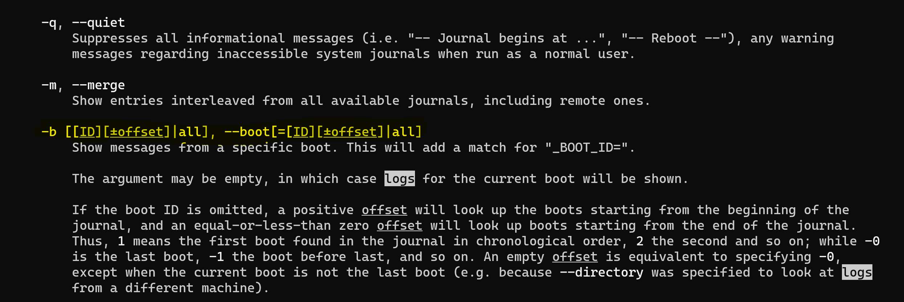
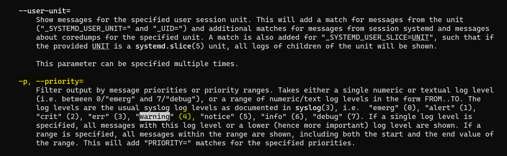
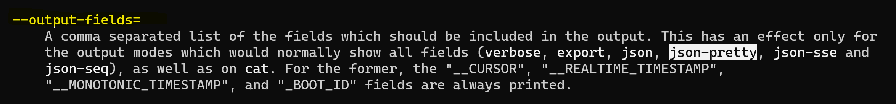

# ACIT 2420 - Finals Exam
## By: Jose Bangate, A01271709   
## Date: Dec. 8, 2022

### Part 1:
Command to update most of the software on your Ubuntu OS   
`sudo apt upgrade`   
   
### Part 2:   
   
To make changes to this file, I used the `R` command to replace more than one character.   
   
### Part 3:   
journalctl command that **print logs for the current boot**   
To find this in the man page, I search the keyword "logs" by tpying the command `/logs` in the man page,   
scroll down until I found the correct command.   
   

journalctl command that includes **priority of warning for logs**   
To find this in the man page, I search the keyword "warning" by typing the command `/warning` in the   
man page, scroll down until I found the correct command.   
   

journalctl command that **output in a nice pretty json**   
To find this in the man page, I search the keyword "json-pretty" by typing the command `/json-pretty` in   
the man page, scroll down until I found the correct command.   
   

   