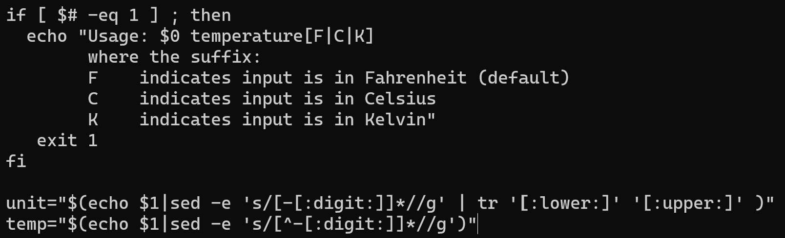

# ACIT 2420 - Finals Exam
## By: Jose Bangate, A01271709   
## Date: Dec. 8, 2022

### Part 1:
Command to update most of the software on your Ubuntu OS   
`sudo apt upgrade`   
   
### Part 2:   
   
To make changes to this file, I used the `R` command to replace more than one character.